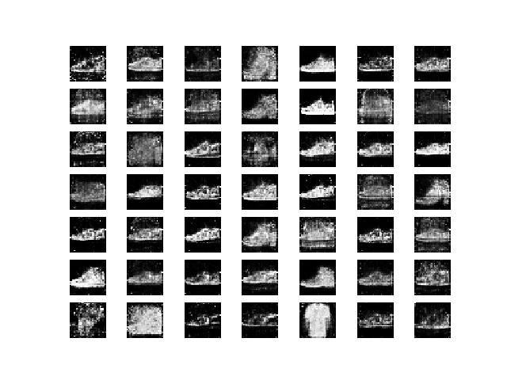

# Creative GAN

## What it does

The model takes a word as input and gives back an image representing that word.  

#### The objective
Is being able to give the model a new word (a word of which he never saw a representation) and having it to return something interesting

## How it does it

The model consist of two parts:

- a **Generator** that produces images
- a **Discriminator** that classifies images

The Discriminator distinguishes **real** from **fake** images of a given set, like birds, or tables.  
The Generator tries to create images, and is given a **positive feedback** when the image it created is classified as real from the Discriminator.  

The more positive feedback the Generator recieves, the more it is able to create images that resemble the real ones.

Both the Generator and the Discriminator recieve 2 inputs:

- The Generator recieves 
    - a noise array
    - a word embedding
- The Discriminator recieves 
    - an image 
    - the word embedding of the image's label

In this way the Generator can be given a word embedding to tell him what to produce, and the Discriminator knows what to expect and classify.

## Where it's trained

I decided to train the model on the [fashion mnist dataset](https://github.com/zalandoresearch/fashion-mnist), a dataset of black and white, 28x28 images in 10 categories (I've slightly modified the labels to make them more understandable by the Word2Vec model):

| Label | Description |
| --- | --- |
| 0 | shirts |
| 1 | trousers |
| 2 | pullover |
| 3 | dress |
| 4 | coat |
| 5 | sandals |
| 6 | shirt |
| 7 | sneakers |
| 8 | bag |
| 9 | boots |

The embedder model is a Word2Vec model trained on 200k articles of Wikipedia, and I used the library [gensim](https://github.com/RaRe-Technologies/gensim) for that.

## How it performs

It can take as input any word, and will return images of the most similar words he learnt to represent.

For example, when asked to produces images of the word *slipper*, it produces mostly shoes:

The reason becomes apparent looking at the similarity between the words of which the model has learned a representation:

- Similarity between slipper and shirts: 0.23937399685382843
- Similarity between slipper and trousers: 0.32302892208099365
- Similarity between slipper and pullover: 0.4327770471572876
- Similarity between slipper and dress: 0.31123432517051697
- Similarity between slipper and coat: 0.3384299576282501
- Similarity between slipper and sandals: 0.5171653628349304
- Similarity between slipper and shirt: 0.3275615870952606
- Similarity between slipper and sneakers: 0.4365991950035095
- Similarity between slipper and bag: 0.4376913607120514
- Similarity between slipper and boots: 0.40576016902923584

## How it can get better

- A better trained Word2Vec model could probably lead to more accurate results
- A larger training set, with more categories, could bring more 'creativity'
- A larger model, like [bigGAN](https://arxiv.org/abs/1809.11096) could substantially increase the quality of images

## What it needs to get there

More computational power :)

